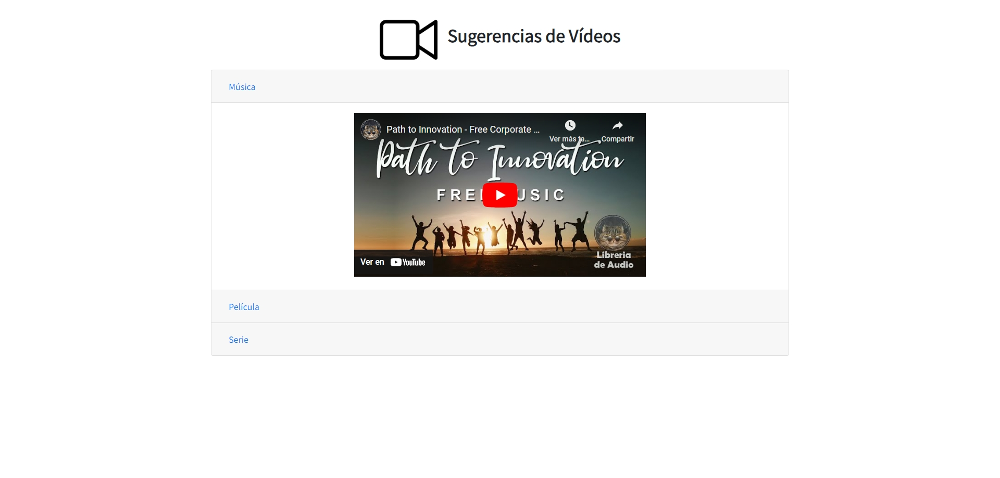
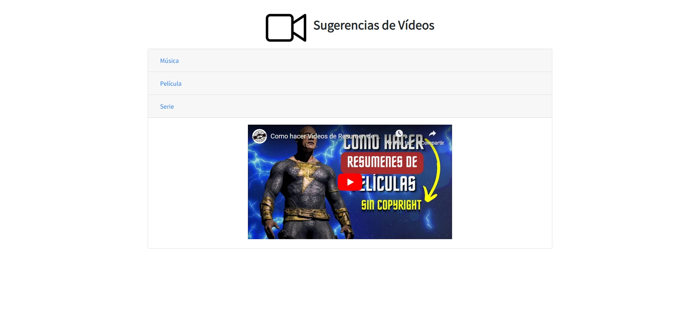

# Desafío evaluado - Sugerencia de videos

Este proyecto tiene como objetivo implementar un sistema en línea para mostrar videos en diferentes categorías (Música, Películas y Series) en un documento HTML. Utiliza técnicas avanzadas de JavaScript, incluyendo el Patrón Módulo mediante IIFE, y la implementación de clases en ES6 para manejar la funcionalidad de la aplicación.

## Descripción

La aplicación consta de un formulario que permite al usuario ver videos en distintas categorías. Los videos se muestran en un formato de acordeón usando Bootstrap, y se cargan en etiquetas `<iframe>`. Los videos son gestionados mediante JavaScript utilizando el Patrón Módulo para la manipulación del DOM y la configuración de los elementos `<iframe>`.

## Vista Codificada

A continuación, se muestra la imagen del resultado codificado:

## Requerimientos

1. **Implementar el Patrón Módulo mediante IIFE**
   - Crear una función privada que reciba la URL del video y el ID del elemento `<iframe>`, para mostrar los videos en el documento HTML.
   - Retornar una función pública que acepte parámetros (`url`, `id`) y llame a la función privada para insertar los elementos recibidos.

2. **Establecer una clase padre denominada `Multimedia`**
   - Recibir la propiedad `url`, que será el atributo `src` necesario para la etiqueta `<iframe>`.
   - Proteger el atributo de la clase usando closures.
   - Agregar un método denominado `setInicio`, que retorne el siguiente mensaje: “Este método es para realizar un cambio en la URL del video”.

3. **Crear una clase `Reproductor` que herede de `Multimedia`**
   - Recibir la propiedad `id`, que corresponde al elemento del DOM necesario para agregar la URL en la etiqueta `<iframe>`.
   - Crear un método denominado `playMultimedia`, que llame a la función pública del módulo IIFE, enviando los atributos `url` e `id`.
   - Agregar un método denominado `setInicio`, que reciba y agregue un tiempo de inicio a la URL de la etiqueta `<iframe>`. Este método modificará la URL agregando `?start=${tiempo}`.

4. **Instanciar la clase hija**
   - Crear tres instancias de `Reproductor`, una para Música, otra para Película y otra para Serie, con sus respectivas URLs.
   - Invocar el método `playMultimedia` para cada instancia creada, mostrando así los videos en el documento HTML.
   - Utilizar el método `setInicio` para modificar el tiempo de inicio en alguna de las instancias creadas.

## Tecnologías Utilizadas

- HTML5
- CSS3
- Bootstrap 5.3.2
- JavaScript 
- jQuery

## Autor

Este proyecto fue desarrollado por **Rodrigo Ahumada**, **Leslie Torres** **Valeria Torrealba**.
